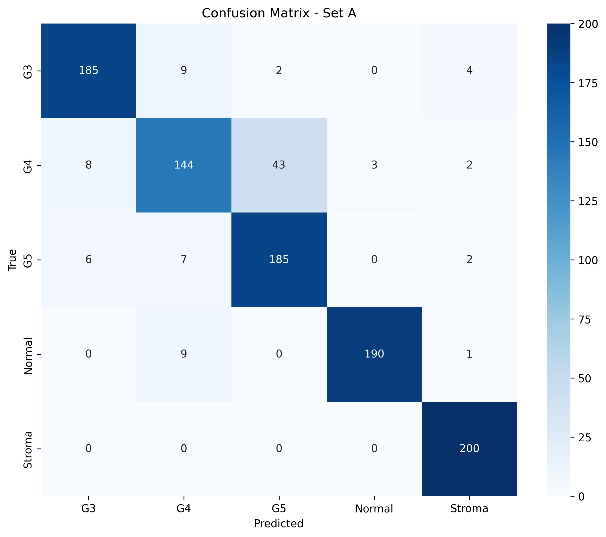
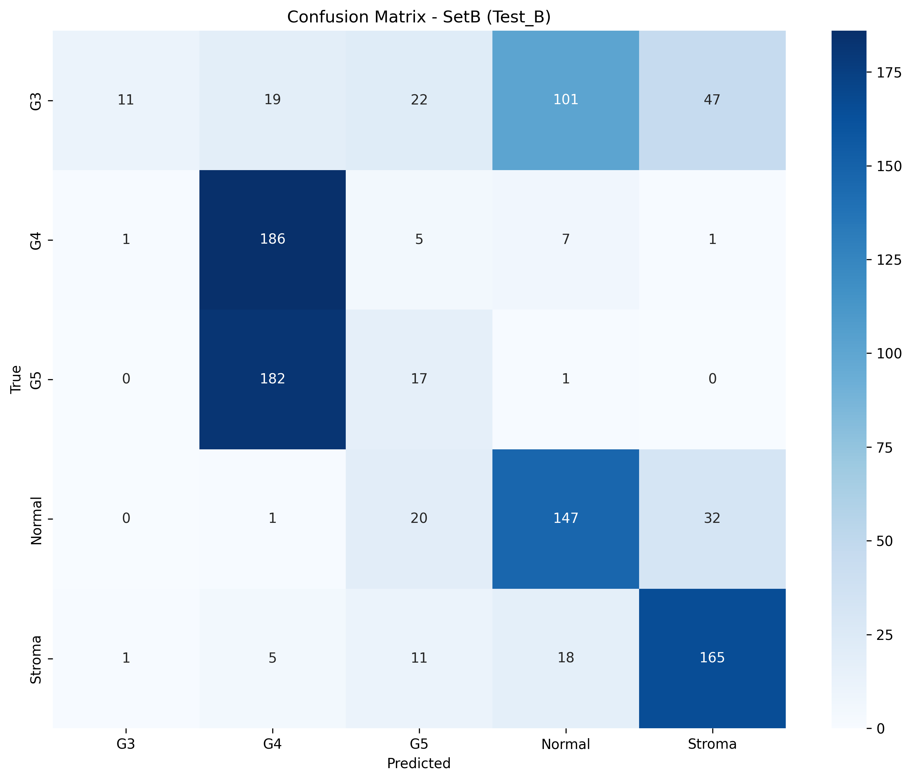
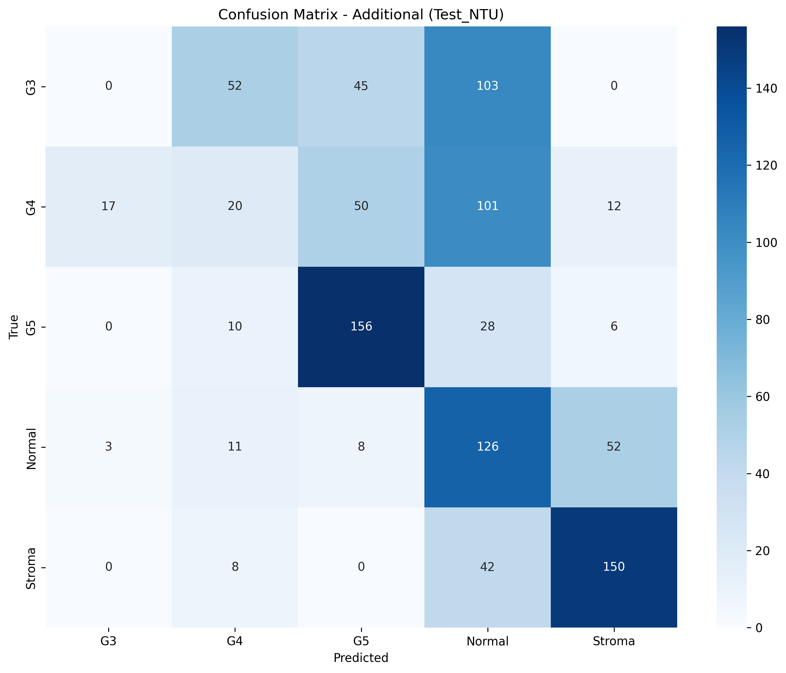
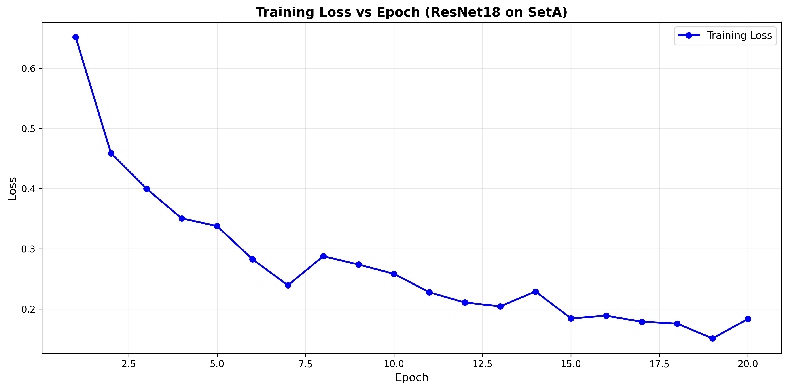

# ResNet18 病理图像五分类诊断系统

**基于迁移学习的深度学习项目**


---

## 📋 项目概述

本项目使用 **ResNet18** 预训练网络，针对病理切片图像进行五分类任务（G3、G4、G5、Normal、Stroma），通过迁移学习和类别权重调整，在同分布测试集上达到 **90.4% 的准确率**。

### 🎯 核心成果

| 指标 | 数值 |
|------|------|
| **SetA 准确率** | 90.40% ✅ |
| **Macro F1-Score** | 0.9026 |
| **平均特异性** | 0.9760 |
| **最佳类别** | Stroma (F1=0.9780) |

---

## 🏗️ 项目结构

```
course_project/
├── data.py                          # 数据加载与增强
├── model.py                         # ResNet18 模型定义
├── main.py                          # 训练主程序
├── evaluate.py                      # SetA 评估脚本
├── project.py                       # SetB 测试脚本
├── calc_specificity.py              # 特异性计算脚本
├── plot_training_curve.py           # 训练曲线绘制
├── plot_confusion_matrices.py       # 混淆矩阵生成
│
├── confusion_matrix_setA.png        # SetA 混淆矩阵（90.4% 准确率）
├── confusion_matrix_setB.png        # SetB 混淆矩阵（53% 准确率，域偏移）
├── confusion_matrix_additional.png  # Additional 混淆矩阵（45% 准确率）
├── training_loss_curve.png          # 训练 Loss 曲线
│
├── training.log                     # 训练日志（20 epochs）
├── resnet18_setA.pth                # 训练好的模型权重
├── README.md                        # 本文件
└── data/                            # 数据集目录（未上传，需自行准备）
    ├── SetA/
    │   ├── 251_Train_A/
    │   ├── 251_Test_A/
    │   ├── SetB/
    │   └── Test_NTU_additional/
```

---

## 🚀 快速开始

### 安装依赖

```bash
pip install torch torchvision
pip install scikit-learn
pip install matplotlib seaborn
pip install tqdm
```

### 训练模型

```bash
python main.py
```

**预期输出：**
- 20 个 epoch 的训练进度条
- 每个 epoch 的 Loss 数值
- 最终在测试集上的分类报告

### 评估模型

```bash
# SetA 测试集评估
python evaluate.py

# SetB 测试集评估
python project.py

# 计算所有数据集的特异性指标
python calc_specificity.py
```

---

## 📊 性能指标

### SetA 测试集（同分布）- ✅ 优秀表现

| 类别 | Precision | Recall | F1 | Specificity |
|------|-----------|--------|-----|-------------|
| G3 | 0.9296 | 0.9250 | 0.9273 | 0.9825 |
| G4 | 0.8521 | 0.7200 | 0.7805 | 0.9688 |
| G5 | 0.8043 | 0.9250 | 0.8605 | 0.9437 |
| Normal | 0.9845 | 0.9500 | 0.9669 | **0.9962** |
| Stroma | 0.9569 | 1.0000 | **0.9780** | 0.9888 |
| **平均** | **0.9055** | 0.9040 | **0.9026** | **0.9760** |



### SetB 测试集（跨机构）- ⚠️ 域偏移


| 类别 | Precision | Recall | F1 | 变化 |
|------|-----------|--------|-----|------|
| G3 | 0.85 | 0.06 | 0.10 | **↓ 91.9%** |
| G4 | 0.47 | 0.93 | 0.63 | ↓ 19.3% |
| G5 | 0.23 | 0.09 | 0.12 | **↓ 86.1%** |
| Normal | 0.54 | 0.73 | 0.62 | ↓ 35.9% |
| Stroma | 0.67 | 0.82 | 0.74 | ↓ 24.3% |
| **整体准确率** | — | — | — | **53%** |



### Additional 测试集（跨研究机构）- ❌ 严重性能衰减

| 类别 | Precision | Recall | F1 | 变化 |
|------|-----------|--------|-----|------|
| G3 | 0.00 | 0.00 | 0.00 | **↓ 100%** |
| G4 | 0.20 | 0.10 | 0.13 | **↓ 83.4%** |
| G5 | 0.60 | 0.78 | 0.68 | ↓ 21.0% |
| Normal | 0.32 | 0.63 | 0.42 | **↓ 56.5%** |
| Stroma | 0.68 | 0.75 | 0.71 | ↓ 27.4% |
| **整体准确率** | — | — | — | **45%** |



---

## 📈 训练过程分析



**关键观察：**
- **Epoch 1-6**：快速下降（0.6518 → 0.2826）
- **Epoch 7-20**：缓慢收敛（0.2394 → 0.1833）
- **收敛质量**：平滑无波动，未见过拟合现象

---

## 🔬 方法细节

### 数据预处理

| 步骤 | 配置 |
|------|------|
| 图像大小 | 224×224 |
| 训练数据增强 | H-flip, V-flip, Rotation(±15°) |
| 标准化 | ImageNet (mean=[0.485,0.456,0.406], std=[0.229,0.224,0.225]) |

### 模型配置

| 参数 | 值 |
|------|-----|
| 基础架构 | ResNet18（预训练） |
| 输出层 | 5 类全连接层 |
| 优化器 | Adam |
| 学习率 | 0.001 |
| Loss 函数 | CrossEntropyLoss（带类别权重） |

### 类别权重设置

针对 G5 样本不足（500 vs 800），设置权重为 1.6 以增加其在损失函数中的重要性：

```python
weights = torch.tensor([1.0, 1.0, 1.6, 1.0, 1.0])
criterion = nn.CrossEntropyLoss(weight=weights)
```

---

## 📌 关键发现

### ✅ 优势

1. **高准确率**：SetA 上达到 90.4% 准确率
2. **完美的 Recall**：Stroma 类达到 100% Recall
3. **鲁棒的特异性**：平均特异性 0.9760，医学应用场景中漏诊风险低

### ⚠️ 不足

1. **跨域泛化能力差**：
   - SetB 准确率 53%（↓ 37.4%）  
   - Additional 准确率 45%（↓ 50.3%）

2. **G4 识别能力弱**：
   - SetA 上 Recall 仅 72%
   - SetB 上 F1-Score 降至 0.63

3. **域偏移敏感性强**：
   - 不同数据源导致性能严重衰减
   - Normal 组织在 Additional 数据集上特异性仅 0.6575

---

## 🔧 改进方向

### 短期改进

- [ ] 增加更多 G4 样本平衡数据
- [ ] 尝试 Focal Loss 处理类别不平衡
- [ ] 调整学习率和 decay 策略

### 中期改进

- [ ] 采用更强的主干网络（ResNet50、EfficientNet）
- [ ] 实现域适配（Domain Adversarial Training）
- [ ] 应用数据增强库（Albumentations）

### 长期方案

- [ ] 收集更多跨机构的多源数据
- [ ] 使用自监督预训练（SimCLR、MoCo）
- [ ] 构建集成模型（Ensemble）
- [ ] 部署时加入置信度阈值和人工审校机制

---

## 📁 数据集说明

### 数据结构（需自行准备）

```
data/
├── SetA/
│   ├── 251_Train_A/
│   │   ├── G3/       (800 images)
│   │   ├── G4/       (800 images)
│   │   ├── G5/       (500 images)
│   │   ├── Normal/   (800 images)
│   │   └── Stroma/   (800 images)
│   │
│   ├── 251_Test_A/
│   │   ├── G3/       (200 images)
│   │   ├── G4/       (200 images)
│   │   ├── G5/       (200 images)
│   │   ├── Normal/   (200 images)
│   │   └── Stroma/   (200 images)
│   │
│   ├── SetB/
│   │   ├── 251_Train_B/  (3700 images)
│   │   └── 251_Test_B/   (1000 images)
│   │
│   └── Test_NTU_additional/
│       └── (1000 images, 5-class balanced)
```

---

## 💾 模型权重下载

已训练的模型权重文件：`resnet18_setA.pth` (43 MB)

```python
# 加载预训练模型
from model import get_resnet_model

model = get_resnet_model(num_classes=5)
model.load_state_dict(torch.load('resnet18_setA.pth'))
model.eval()

# 推理
with torch.no_grad():
    output = model(input_tensor)
    prediction = output.argmax(dim=1)
```

---

## 📄 引用文献

- He, K., Zhang, X., Ren, S., & Sun, J. (2016). Deep residual learning for image recognition. *CVPR*.
- Kingma, D. P., & Ba, J. (2014). Adam: A method for stochastic optimization. *ICLR*.

---

## 📧 联系方式

如有问题或建议，欢迎提交 Issue 或 Pull Request！

## 📄 许可证

MIT License - 详见 [LICENSE](LICENSE) 文件

---

**最后更新**: 2026年3月2日
